---
# pandoc whitepaper_esp.md -o whitepaper.pdf --pdf-engine=xelatex --include-in-header=header.tex --number-sections
geometry: top=5cm, left=4cm, right=4cm, bottom=4cm
figures-latex-placement: H
fontsize: 10pt
---
\begin{flushleft}
{\fontsize{16pt}{16pt}\selectfont \textbf{Renderizado de fractales con MPI}}
\end{flushleft}

\begin{flushleft}
{\fontsize{12pt}{12pt}\selectfont \textbf{Franco Yudica y Martín Farrés}}
\end{flushleft}

*Abstract: Este trabajo presenta el desarrollo de una implementación paralela de renderizado de fractales bidimensionales, mostrando sus diferencias con la versión secuencial. Además se detalla sobre los experimentos realizados para determinar el rendimiento de la aplicación, en conjutno con conclusiones sobre tales resultados.*

*Keywords: Fractals, Mandelbrot Set, Julia Set, Programación paralela, MPI, Números Complejos, Sistemas Dinámicos, Gráficos de Computadora, Evaluación de Resultados.*


# Introducción

El renderizado eficiente de imágenes fractales representa un reto significativo en el ámbito de la computación gráfica, debido a la complejidad matemática involucrada y la alta demanda computacional que implica su visualización detallada. Los fractales, como el conjunto de Mandelbrot o los conjuntos de Julia, se caracterizan por su estructura auto-similar e infinita complejidad, lo que requiere un gran número de cálculos por píxel para generar imágenes precisas y atractivas.

Este informe presenta el desarrollo y análisis de un sistema de renderizado de fractales, implementado utilizando técnicas de paralelización y optimización computacional. El objetivo principal es reducir el tiempo de renderizado, aprovechando al máximo los recursos de hardware disponibles.

En primer lugar, se describe el proceso secuencial de renderizado de fractales, abordando las ecuaciones iterativas involucradas y los criterios de escape utilizados para determinar la convergencia o divergencia de cada punto. Luego, se introduce la versión paralela del sistema, explicando las estrategias utilizadas para distribuir el trabajo entre múltiples hilos o nodos, y las optimizaciones aplicadas para mejorar la eficiencia.

A continuación, se presentan los experimentos realizados para evaluar el rendimiento del sistema, analizando métricas como el speedup, la eficiencia y la escalabilidad en diferentes configuraciones. Se incluyen también comparaciones visuales y tiempos de renderizado, acompañados de una discusión sobre los resultados.

Finalmente, se exponen las conclusiones obtenidas a partir del análisis, resaltando las ventajas y limitaciones del enfoque propuesto. Se sugieren además posibles líneas de mejora, incluyendo la exploración de técnicas de paralelización mediante el uso de hilos.

# Marco teórico

En esta sección se desarrolla el marco teórico fundamental de los fractales, realizando una breve introducción a la dinámica compleja [\[7\]](#complex-dynamics), conjuntos de Julia y Fatou [\[9\]](#Julia-fatou), fractales de Julia y Mandelbrot [\[2\]](#Mandelbrot), y las técnicas de coloreo de fractales utilizadas en este proyecto.

## Dinámica compleja

La dinámica compleja, también conocida como dinámica holomorfa [\[7\]](#complex-dynamics), es una rama de la matemática que estudia el comportamiento de los sistemas dinámicos [\[8\]](#dynamic-systems) obtenidos mediante la iteración de funciones analíticas en el plano complejo. A diferencia de los sistemas dinámicos en el plano real, la estructura adicional que proporciona la analiticidad en los números complejos introduce una rica variedad de comportamientos geométricos y topológicos que han sido ampliamente estudiados desde principios del siglo XX.

Una función compleja $f:C→C$ se itera generando una secuencia de funciones

$$
f^n(z)=f(f^{n-1}(z))
$$

donde $n \in \mathbb{N}$. El objeto de estudio principal es el conjunto de órbita de un punto $z$, definido como la secuencia de sus imágenes sucesivas bajo iteraciones de $f$. Esta órbita puede exhibir distintos comportamientos: puede tender al infinito, converger a un punto fijo o seguir una trayectoria caótica.

Un ejemplo clásico y fundamental es la función cuadrática:

$$
    f(z) = z²
$$

Aunque simple, esta función exhibe una variedad de comportamientos interesantes dependiendo del punto de partida $z_0$

Por ejemplo:

$$
    Si |z_0| < 1, entonces f^n(z_0) → 0
$$

$$
    Si |z_0| > 1, entonces f^n(z_0) → ∞
$$

$$
    Si |z_0| = 1, entonces f^n(z_0) → 1
$$

## Conjuntos de Julia y Fatou

El estudio de estas órbitas lleva a la clasificación del plano complejo en dos regiones fundamentales:

- El conjunto de Fatou, donde las órbitas tienen un comportamiento estable bajo pequeñas perturbaciones iniciales.
- El conjunto de Julia, que contiene puntos con un comportamiento altamente sensible a las condiciones iniciales, caractarizado por su complejiad fractal.

Estos conjuntos son complementarios y su frontera compartida representa el límite entre estabilidad y caos. En el caso de $f(z) = z²$, el conjunto de Julia es el círculo unitario $|z|=1$, mientras que el conjunto de Fatou está formado por el interior y el exterior de tal círculo.

## Fractal Julia

Los conjuntos de Julia se generan utilizando números complejos. Estos poseen dos componentes, real e imaginaria, y pueden representarse como puntos en un plano bidimensional, lo que permite renderizar el fractal sobre una imagen 2D. Para cada píxel de la imagen, su coordenada $(x,y)$ en el plano se utiliza como entrada en una función recursiva.

El fractal de Julia es un ejemplo clásico de fractal de tiempo de escape, lo que significa que el interés está en determinar si, tras aplicar repetidamente una función compleja, el valor resultante tiende al infinito o no.

La función recursiva que define el conjunto de Julia es:

$$
z_{n+1}=z_n²+c
$$

donde:

- $z_n$​ es el valor complejo en la iteración $n$,
- $z_0$​ es la posición del píxel en el plano complejo, escrita como $z_0=p_x+p_yi$
- $c$ es una constante compleja, $c=c_x+c_yi$, que permanece fija durante toda la generación del fractal.

Está demostrado que si $∣z_n∣>2$, entonces la sucesión diverge (tiende a infinito). En este contexto, el valor 2 se denomina bailout, y es el umbral utilizado para determinar la divergencia. [\[5\]](#fractal-rendering).

## Fractal Mandelbrot

El fractal de Mandelbrot es muy similar al de Julia, ya que también se trata de un fractal de tiempo de escape. La principal diferencia radica en la función recursiva y en los valores iniciales utilizados.

La función que define al conjunto de Mandelbrot es:

$$
z_{n+1} = z_n^2 + p
$$

donde:

- $p$​ es la posición del píxel en el plano complejo, de la forma $p=p_x+p_yi$,

- $z_n$​ inicia en 0, es decir, $z_0=0$, y se itera añadiendo el valor constante $p$​ en cada paso.

Al igual que en el caso del fractal de Julia, el criterio de escape se basa en si $|z_n∣>2$, utilizando el mismo valor de bailout.
[\[2\]](#Mandelbrot), [\[5\]](#fractal-rendering).

## Coloreo de fractales

Existen distintos métodos para colorear fractales, siendo el más básico el blanco y negro. En este esquema, los píxeles cuya posición, al ser utilizada como punto de partida en la iteración del fractal, tienden al infinito, se colorean de blanco. Por el contrario, aquellos que no divergen se colorean de negro.

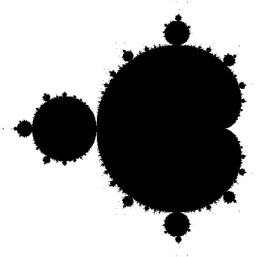{ width=60% .center }
  Figura 1: *Representación en blanco y negro del conjunto de Mandelbrot.

Sin embargo, este método binario puede resultar limitado para visualizar la complejidad del sistema dinámico. Por ello, se utilizan técnicas más avanzadas como el coloreo por tiempo de escape (escape time coloring), donde se asignan colores según la cantidad de iteraciones que tarda un punto en escapar de un cierto radio. Esto permite generar imágenes con ricos gradientes de color que reflejan la velocidad de divergencia y destacan la estructura del borde del conjunto. [\[5\]](#fractal-rendering).

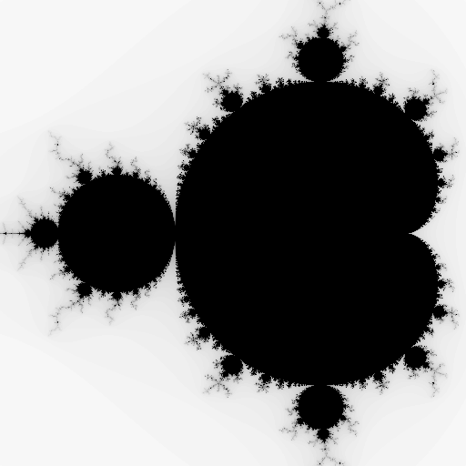{ width=60% .center }
  Figura 2: Representación en escala de grises del conjunto de Mandelbrot.


Pero también es posible mapear el número de iteraciones a una paleta de colores. Nótese que los puntos pertenecientes al conjunto de Mandelbrot toman un color uniforme, ya que alcanzan el número máximo de iteraciones sin divergir.

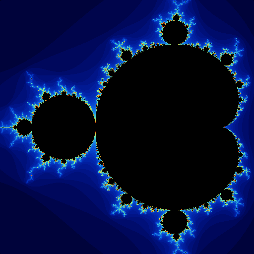{ width=60% .center }
  Figura 3: Mapeo de iteraciones a paleta de colores del conjunto de Mandelbrot.


En la figura 3 se pueden observar resultados mucho más interesantes. Al mirar con detalle, se aprecian transiciones abruptas entre los colores, un efecto comúnmente denominado *banding* en computación gráfica. Esto se debe a que el mapeo del color se realiza únicamente en función de la cantidad de iteraciones, que es un valor discreto.

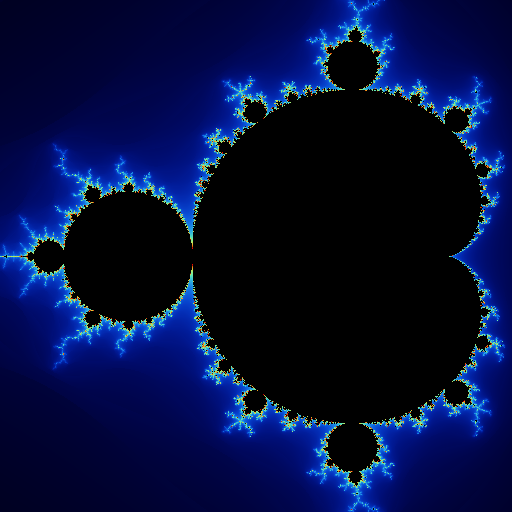{ width=60% .center }
  Figura 4: Mapeo de iteraciones a colores con transición suave.


Para renderizar la figura 4, se ha utilizado el número de iteraciones, en conjunto con $|z_n|$,  lo cuál permite realizar un mapeo continuo a la paleta de colores, eliminando el efecto de *banding*. El desarrollo matemático se encuentra en la referencia [\[5\]](#fractal-rendering).


# Desarrollo

El algoritmo para el desarrollo de dichas imagenes se resume en, la obtencion del color correspondiente segun la formula de fractal aplicada a cada pixel de la imagen. Para la cuál se desarrollo una funcion de renderizado **render_block**;

```python
def render_block(x_inicial, y_inicial, ancho, alto):

    for j in range(alto):

        for i in range(ancho):

            pixel_x = x_inicial + i
            pixel_y = y_inicial + j

            # Calcular coordenadas normalizadas [-1.0, 1.0]
            nx, ny = calcular_ndc(pixel_x, pixel_y)

            # Convertir (nx, ny) a coordenadas del mundo (wx, wy) usando la camara
            wx, wy = camera.to_world(nx, ny)

            # Evaluar el fractal, obteniendo las iteraciones normalizadas [0.0, 1.0]
            t = fractal(wx, wy)
            r, g, b = color(t)
            
            # Guardar el color en el buffer
            guardar_buffer(r, g, b, pixel_x, pixel_y)
```

La funcion se encarga del procesamiento de la imagen fractal. Para cada píxel, el algoritmo toma varias muestras con un pequeño desplazamiento aleatorio (antialiasing) para disminuir el ruido obtenido en la imagen final. Luego cada muestra se transforma en coordenadas del mundo con una cámara virtual. Las mismas son evaluadas por **funcion_fractal** para obtener un valor que, luego es transformados a valores rgb utilizando la funcion, **funcion_color**. Finalmente, dichos valores se promedian obteniendo así el color para cada pixel de la imagen.

Para el desarrollo del problema se hicieron dos versiones, secuencial y paralalelo, para observar las diferencias de ambas en terminos de tiempo y costo computacional.

## Secuencial

El código secuencial implementa un enfoque lineal para resolver el problema de renderizado. El algoritmo recibe varios parámetros de configuración, tales como el ancho y alto de la imagen, la posición y el nivel de zoom de la cámara, el tipo de fractal a calcular, entre otros. A partir de esta información, se invoca directamente la función de renderizado, y una vez finalizado el proceso, se guarda la imagen resultante.

El procesamiento es completamente secuencial: cada píxel de la imagen es calculado uno por uno, sin ningún tipo de paralelismo o concurrencia. Esto lo convierte en una implementación sencilla pero poco eficiente para imágenes de alta resolución o fractales complejos.


## Paralelo

Dado que el renderizado de fractales es una tarea altamente demandante en términos computacionales, se exploró una versión paralela del algoritmo con el objetivo de reducir significativamente el tiempo de ejecución.

## Identificación del paralelismo
El renderizado de fractales es un problema naturalmente paralelizable. Cada píxel de la imagen puede calcularse de forma independiente, ya que no requiere información de los píxeles vecinos ni de ningún otro elemento de la imagen. Esta independencia permite dividir la carga de trabajo entre múltiples procesos o hilos de ejecución sin necesidad de sincronización compleja, lo que lo convierte en un caso ideal para aplicar técnicas de paralelismo.

## Secciones secuenciales y paralelizables
El algoritmo presenta tanto secciones secuenciales como paralelizables.

Las secciones secuenciales incluyen la etapa de inicialización, en la cuál se configura el entorno de ejecución, se inicializa la biblioteca MPI y se definen las tareas o bloques de la imagen que serán distribuidos a los procesos workers. La etapa de finalización también es secuencial, ya que implica recopilar los bloques renderizados, ensamblar la imagen final y guardarla en disco. Estas etapas requieren acceso centralizado a ciertos recursos y coordinación general, lo que limita su paralelización.

Por otro lado, la sección paralelizable corresponde al renderizado de los bloques de imagen. Dado que cada bloque puede ser procesado de forma independiente, esta etapa se distribuye entre los distintos procesos para acelerar significativamente el tiempo total de ejecución.

## Estrategia de descomposición
El renderizado de fractales representa un caso típico para aplicar una estrategia de descomposición de dominio. Esta técnica consiste en subdividir el dominio del problema, en este caso, la imagen a renderizar, en múltiples subregiones independientes. Concretamente, la imagen se divide en bloques rectangulares, cada uno definido por una tupla de la forma (x, y, ancho, alto), que indica la posición y dimensiones del bloque dentro de la imagen global.

## Modelo de algoritmo paralelo
Se adopta un modelo master-worker. En este esquema, el nodo master se encarga de dividir la imagen en bloques y distribuir el trabajo entre los distintos procesos workers. Además, coordina las solicitudes de tareas, asigna bloques disponibles de forma dinámica y recibe los resultados procesados por cada worker.

Una vez que los bloques son completados, el master se encarga de ensamblar los resultados parciales en un búfer central, que luego se utiliza para generar la imagen final.

### Asignación de tareas y balanceo de carga
Esta aproximación inicial ya demuestra mejoras en el tiempo total de cómputo, aunque revela un desbalanceo de carga cuando algunos bloques requieren más cómputo que otros, siendo esta una característica común en el renderizado de fractales, dejando procesos inactivos mientras otros siguen trabajando.

Por ejemplo, si las ocho tareas tienen duraciones (en ms) [10, 10, 10, 10, 20, 30, 40, 50] y se reparten estáticamente en dos nodos:

- **Nodo1** recibe las cuatro primeras tareas: 10 + 10 + 10 + 10 = 40 ms de trabajo y permanece inactivo los 100 ms restantes.

- **Nodo2** recibe las cuatro últimas: 20 + 30 + 40 + 50 = 140 ms, completando todo el render en 140 ms.

Para resolver este desbalanceo se implementó un balanceo de carga dinámico basado en asignación bajo demanda. En lugar de asignar bloques estáticamente, el master mantiene una cola de tareas y cada worker solicita un nuevo bloque tan pronto como finaliza el anterior. De este modo, el tiempo de inactividad de los procesos se reduce significativamente y se optimiza el uso de los recursos de cómputo. Con la misma serie de duraciones y balanceo dinámico:

- **Nodo1** procesa: 10 + 10 + 10 + 10 + 50 = 90 ms.

- **Nodo2** procesa: 20 + 30 + 40 = 90 ms,

logrando que ambos nodos terminen en 90 ms y minimizando los períodos ociosos.

### Sincronismo - Asincronismo

El sistema implementado utiliza un modelo de comunicación sincrónico. Los mensajes intercambiados entre el nodo master y los workers se gestionan mediante llamadas bloqueantes, donde tanto el emisor como el receptor deben estar sincronizados para que la operación de envío o recepción se complete.

Este enfoque simplifica la lógica de coordinación y garantiza un flujo de ejecución controlado, aunque puede introducir ciertos periodos de espera innecesarios si alguno de los procesos se encuentra inactivo temporalmente.

En este contexto, los beneficios de un modelo asincrónico serían mínimos, ya que el tiempo de comunicación es muy bajo en comparación con el tiempo de cómputo, siendo este último dominado por el proceso de renderizado.

## Pseudocódigo de `master`

```python
def master(num_procs, settings):
    # Crear buffer de imagen
    imagen = crear_buffer_imagen(settings)

    # Dividir imagen en bloques de trabajo
    worker_tasks = dividir_en_tareas(imagen)

    sent = 0
    done = 0

    while done < len(worker_tasks):

        mensaje, origen = mpi_esperar_mensaje()

        if mensaje.tag == "REQUEST":
            if sent < len(worker_tasks):
                tarea = worker_tasks[sent]
                mpi_enviar(tarea, destino=origen, tag="TASK")
                sent += 1
            else:
                mpi_enviar(None, destino=origen, tag="TERMINATE")

        elif mensaje.tag == "RESULT":
            bloque = recibir_mensaje(fuente=origen)
            copiar_bloque_en_buffer(imagen, bloque)
            done += 1

    # Enviar TERMINATE a todos los workers
    for rank in range(1, num_procs):
        mpi_broadcast(tag="TERMINATE")

    # Guardar imagen final
    guardar_imagen(imagen)

```

La función master comienza reservando un búfer para la imagen completa y dividiendo el área de renderizado en bloques de tamaño fijo, que se almacenan en una lista de tareas. A continuación, mantiene dos contadores: uno para las tareas enviadas y otro para las tareas completadas. En un bucle principal, espera mensajes de los masteres; cuando recibe una petición de trabajo, comprueba si aún quedan bloques sin asignar y, en caso afirmativo, envía el siguiente bloque, o bien envía una señal de terminación si ya no hay más. Cuando recibe el resultado de un bloque, copia los píxeles de ese fragmento en la posición correspondiente del búfer global y actualiza el contador de tareas completadas. Este proceso se repite hasta que todas las tareas han sido procesadas, momento en el cuál el master envía una señal de terminación a cada worker, detiene el temporizador y muestra el tiempo total de cómputo. Finalmente, invoca al manejador de salida para guardar el búfer como imagen.

## Pseudocódigo de `worker`

```python
def worker(rank, config_imagen, config_fractal, camara):
    while True:

        # Worker listo, solicita tarea
        enviar_mensaje(destino=master, tag="REQUEST")
        mensaje = recibir_mensaje(master)

        if mensaje.tag == "TASK":

            # Recibe el bloque a renderizar
            x, y, ancho, alto = recibir_tarea(fuente=master)
            buffer = crear_buffer(ancho * alto * 3)

            # Renderiza
            render_block(
              buffer, 
              config_imagen, 
              config_fractal, 
              camara, 
              x, 
              y, 
              ancho, 
              alto)

            # Envía el bloque renderizado
            mpi_enviar(
              buffer, 
              destino=master, 
              tag="RESULT")

        elif mensaje.tag == "TERMINATE":
            recibir_senal_terminacion()
            break
```

La función worker empieza enviando al master una petición de tarea y se bloquea hasta recibir una respuesta. Cuando llega una tarea, el worker crea un búfer para la sección asignada, invoca render_block para rellenarlo con los píxeles fractales correspondientes y luego devuelve tanto la descripción de la tarea como su contenido al proceso master. Este ciclo de petición–procesamiento–envío se repite hasta que el master indica la terminación, momento en el cuál el worker sale del bucle y finaliza su ejecución.

## Parámetros de Funcionamiento

En esta sección se describen en detalle los comandos de ejecución de la aplicación DistributedFractals, tanto en modo secuencial como distribuido, los parámetros de entrada disponibles y las condiciones necesarias del entorno para su correcto funcionamiento.

### Requisitos y Condiciones del Entorno

Para garantizar la reproducibilidad de los experimentos y el correcto funcionamiento de la plataforma de renderizado distribuido, el entorno de ejecución debe satisfacer los siguientes requisitos hardware, software y de configuración:

- **Sistema Operativo**:
  - Linux (distribuciones basadas Debian GNU/Linux)
- **Herramientas de Construccion**:
  - **CMAKE** version >= 3.14
  - **Compilador C++** con soporte para estandar C++17 (p. ej., `g++ 7.5+, clang++ 8+` )
- **Implementacion MPI**
  - **MPICH** >= 3.2 o **OpenMPI** >= 4.0
  - Variables de entorno configuradas ( `MPI_HOME`, `PATH`, `LD_LIBRARY_PATH`)
  - Acceso a los binarios `mpirun` y/o `mpiexec`
- **Bibliotecas de tiempo de ejecución**
  - Librerías estándar de C++17 (`libstdc++`, `libm`)
  - Librerías MPI (`openmpi-bin`, `openmpi-bin`, `openmpi-common`)

### Instrucción de Construccion


Previo a la ejecuccion, es necesario construir el ejecutable. Para ello, primero instalar las dependencias necesarias:

```bash
sudo apt install openmpi-bin openmpi-bin openmpi-common
```

Luego, dentro de la carpeta `DistributedFractals` ejecutar:

```bash
mkdir build
cd build
cmake ..
make
```

### Parámetros de Entrada

La aplicación admite los siguientes parámetros de entrada:


| Parámetro | Descripción | Valor por defecto |
| ------------------------- | --------------------------------------------------------------- | ----------------- |
| `--width` | Ancho de la imagen (píxeles) | 800 |
| `--height` | Alto de la imagen (píxeles) | 600 |
| `--zoom` | Nivel de zoom | 1.0 |
| `--camera_x` | Posición X del centro de la cámara | 0.0 |
| `--camera_y` | Posición Y del centro de la cámara | 0.0 |
| `--iterations` | Máximo número de iteraciones | 100 |
| `--type` | Identificador de tipo de fractal (0 = Mandelbrot, 1 = Julia, …) | 0 |
| `--color_mode` | Modo de coloreado | 0 |
| `--block_size` | (MPI) Tamaño de bloque en píxeles | 64 |
| `--samples` | (MPI) Número de muestras MSAA | 1 |
| `--output_disk` | Ruta de salida para guardar la imagen en disco | `output.png` |
| `--Julia-cx` | Componente real de la constante $C$ (solo Julia) | 0.285 |
| `--Julia-cy` | Componente imaginaria de la constante $C$ (solo Julia) | 0.01 |

Tabla 1: Parámetros de entrada de los programas.

### Ejecución Secuencial

La versión secuencial de la aplicación permite generar imágenes fractales utilizando un único proceso de cómputo. El ejecutable asociado se denomina `sequential`.

```bash
./sequential [OPCIONES]
```

### Ejecución Distribuida (MPI)

La versión paralela aprovecha MPI para repartir bloques de cálculo entre varios procesos. El ejecutable se denomina `fractal_mpi`.

```bash
mpirun -np <N> ./fractal_mpi [OPCIONES]
```

donde `<N>` es el número de procesos MPI.

**Ejemplo de Uso**

```bash
# Con 8 procesos MPI y parámetros personalizados
mpirun -np 8 ./fractal_mpi \
  --width 1080 \
  --height 720 \
  --zoom 1.5 \
  --camera_x -0.7 \
  --camera_y 0.0 \
  --iterations 256 \
  --type 0 \
  --block_size 64 \
  --samples 4 \
  -output_disk mandelbrot_distribuido.png
```

# Diseños de Experimentos

Primero, se plantea un estudio comparativo entre la versión secuencial y la paralela bajo distintas cantidades de nodos, con el fin de evaluar la eficiencia y el speedup.

Luego, se analiza en profundidad el comportamiento de la versión paralela frente a diferentes configuraciones de parámetros.

Es importante aclarar que cada una de las mediciones se basa en el tiempo de ejecución medio, el cuál se obtuvo a partir del promedio de al menos 10 ejecuciones, con el objetivo de asegurar resultados representativos y confiables.

## Parámetros utilizados

Los siguientes parámetros se mantienen constantes a lo largo de todos los experimentos.

| Parámetro | Valor |
| --------- | ----- |  
| `samples`              | $4$       |
| `cx`| $-0.7454286$ |
| `cy`| $0.1130089$ |
| `zoom`| $327000$ |
| `color_mode`| $5$ |
| `type`  |       $Mandelbrot$  |
| `output_disabled` |    -     |
Tabla 2: Parámetros constantes en los experimentos.

Nótese que se utiliza el parámetro `output_disabled` ya que el fin de los experimentos radica en el cómputo del buffer con los colores de los píxeles. El proceso de creación de imágenes PNG y su escritura en el disco puede tomar una considerable cantidad de tiempo, especialmente en ejecuciones rápidas.

## Versión secuencial contra paralela

Con el objetivo de realizar una comparación exhaustiva entre la versión secuencial y la versión paralela de la aplicación, se han considerado dos tipos de atributos, la resolución de la imagen y el tamaño de los bloques.

Los siguientes experimentos se ejecutan utilizando diferentes cantidades de procesos MPI: $[2, 4, 8, 16, 32]$, con el fin de evaluar la **eficiencia** y el **speedup** de la versión paralela, en comparación con la versión secuencial.

### Resolución de imagen

Un factor determinante es la resolución de la imagen, especificada por los parámetros width y height. Para simplificar, se utilizaron imágenes cuadradas con $width = height$. Se realizaron ejecuciones para los siguientes tamaños:

|Caso| Resolución|
| ----   |    -    |
| 0 | $32 \times 32$|
| 1 | $64 \times 64$|
| 2 | $128 \times 128$|
| 3 | $512 \times 512$|
| 4 | $1080 \times 1080$|
| 5 | $1920 \times 1920$|
Tabla 3: Resoluciones utilizadas en los experimentos.

Además de los parámetros establecidos anteriormente, se ha fijado:

| Parámetro | Valor |
| --------- | ----- |  
| `block_size`           |   $32$    |
| `iterations`           |   $20000$    |
Tabla 4: Parámetros extra constantes.

### Tamaño de bloque
Permite analizar el impacto del tamaño de bloque en el balanceo de carga entre nodos, con el objetivo de encontrar un valor óptimo.

| Parámetro | Valor |
| --------- | ----- |  
| `width`           |   $1080$    |
| `height`           |   $1080$    |
| `iterations`           |   $20000$    |
Tabla 5: Parámetros extra constantes.

Se ha fijado la resolución ya que en este caso nos interesa estudiar el impacto del tamaño de bloque.

Los tamaños de bloque evaluados son:

$$
[2 \times 2, 4 \times 4, 8 \times 8, 16 \times 16, 32 \times 32, 64 \times 64, 128 \times 128]
$$

## Experimentación de balanceo de carga mediante herramientas de *Profiling*

Este experimento tiene como objetivo realizar un análisis cuantitativo del tiempo de ejecución de los distintos componentes del programa paralelo, con especial foco en el balanceo de carga entre procesos. Para ello, se emplean herramientas especializadas de profiling, como *Score-P* [\[10\]](#score-p) para la recolección de datos y *Vampir* [\[11\]](#vampir) para su visualización y análisis detallado.

Es importante aclarar que este experimento se basa en una única ejecución por cada una de las configuraciones evaluadas, con el propósito de analizar casos aislados y particulares, permitiendo una interpretación más detallada del comportamiento del programa bajo cada escenario.

Se analiza el comportamiento del programa variando el tamaño de bloque utilizado: 
$$
[2 \times 2, 16 \times 16, 128 \times 128]
$$

Se presta especial atención a los métodos que involucran comunicaciones, como las llamadas a MPI, y al procedimiento `render_block`, descrito anteriormente en la sección de pseudocódigo paralelo.

Para cada función ejecutada se registran y estudian las siguientes métricas clave:
- Tiempo promedio.
- Cantidad de invocaciones.

| Parámetro | Valor |
| --------- | ----- |  
| `width`           |   $1080$    |
| `height`           |   $1080$    |
| `np` (Cantidad de nodos)           |   $8$    |
Tabla 6: Parámetros extra constantes.

Cabe destacar que se ha optado por utilizar 8 nodos con el objetivo de facilitar la interpretación de los datos y simplificar el proceso de recolección. Además, el propósito de este experimento no es evaluar métricas clásicas como el speedup o la eficiencia paralela, sino analizar cómo distintas configuraciones del tamaño de bloque afectan el balanceo de carga entre procesos.


## Cantidad de iteraciones

Una parte fundamental del renderizado de fractales consiste en determinar el número adecuado de iteraciones a utilizar. El objetivo es minimizar este valor para reducir los tiempos de cómputo, sin comprometer la calidad de la imagen generada. Por esta razón, en este experimento se renderizarán imágenes utilizando distintas cantidades máximas de iteraciones.

Los valores evaluados para el número máximo de iteraciones son: 
$$
[200, 500, 1000, 2000, 3000, 4000, 5000, 10000, 15000, 20000, 40000]
$$

Este análisis resulta especialmente relevante para entender cómo impacta la cantidad de iteraciones tanto en el tiempo de ejecución como en la calidad visual de los fractales. Además, permite observar cómo varía el tiempo de procesamiento al aumentar el número máximo de iteraciones, y evaluar si dicha relación sigue un comportamiento lineal, logarítmico o exponencial.

Cabe destacar que este experimento se realiza exclusivamente sobre la versión paralela del algoritmo, dejando de lado la versión secuencial. Esto se debe a que los experimentos anteriores ya han proporcionado información suficiente para su comparación, y este estudio particular no aporta datos adicionales relevantes para dicha versión.

| Parámetro | Valor |
| --------- | ----- |  
| `width`           |   $1080$    |
| `height`           |   $1080$    |
| `block_size`           |   $32$    |
| `np` (Cantidad de nodos)           |   $32$    |
Tabla 7: Parámetros extra constantes.


## Consideraciones sobre experimentos

Con el fin de garantizar la validez de los resultados, se han tomado en cuenta los siguientes criterios:

- Todas las ejecuciones se realizan sobre la misma configuración de hardware, un cluster de nodos Debian con CPU de cuatro núcleos físicos, los cuales forman un total de 32 nodos computacionales. 

- Misma versión de **OpenMPI (4.1.4)**. 
- Las compilaciones se efectúan con optimización `-O3`.
- Aquellos parámetros que no se hayan especificado, toman su valor por defecto.
- La función de temporización utilizada, `perf_counter()` de la libreria `time` en python, se invoca de manera uniforme en todas las pruebas. 

Con este riguroso control de variables, los resultados obtenidos reflejan de forma confiable el impacto de los factores estudiados sobre el tiempo de renderizado, el speedup y la eficiencia de la versión paralela, permitiendo extraer conclusiones sólidas sobre sus límites de escalabilidad y sus puntos de inflexión en el rendimiento.

# Resultados Obtenidos

En esta sección se presentarán los resultados obtenidos al realizar los experimentos planteados en la sección de diseño de experimentos. Es por este motivo que seguirá la misma estructura planteada anteriormente. Se presentarán tablas de datos y gráficos, los cuales serán analizados en detalle en la sección de análisis de resultados.

## Versión secuencial contra paralela

A continuación se muestra el rendimiento de ambas versiones en función del tamaño de la imagen y la cantidad de nodos utilizados.

### Tamaño de imagen

Se estudió el efecto de modificar la resolución de imagen en el tiempo de ejecución.

#### Tabla de datos de ejecución secuencial

A modo de comparación, se incluye el tiempo de ejecución para la versión secuencial con cada resolución.

| Resolución | Tiempo promedio (s) | Desviación estándar (s) |
| --- | --- | --- |
| 32x32 | 0.07977260379984731 | 0.00043435765082315455 |
| 64x64 | 0.31759674040004027 | 0.002131164715677036 |
| 128x128 | 1.2609421436000048 | 0.0013148213508798747 |
| 512x512 | 20.132811490099993 | 0.009180779629399193 |
| 1080x1080 | 89.59314089329982 | 0.024588972955427328 |
| 1920x1920 | 283.25439927300033 | 0.04803506827399954 |
Tabla 8: Tiempo promedio y desviación estándar en segundos para cada configuración de resolución sobre versión secuencial.

#### Tabla de datos de ejecución paralela

Se presenta el tiempo promedio y la desviación estándar para distintas resoluciones y cantidades de nodos.

| Cantidad de nodos | Resolución | Tiempo promedio (s) | Desviación estándar (s) |
| --- | --- | --- | --- |
| 2 | 32x32 |0.7347766071998194 | 0.024293793933656622 |
| 4 | 32x32 |0.7194581487994582 | 0.019995011884794463 |
| 8 | 32x32 |0.7597506460006116 | 0.019692794415084734 |
| 16 | 32x32 |0.755642992799767 | 0.014237480350074726 |
| 32 | 32x32 |0.7530325819996506 | 0.014154650552929655 |
| 2 | 64x64 |0.9698013217999687 | 0.04280733081779699 |
| 4 | 64x64 |0.7844574396993267 | 0.02057444796819635 |
| 8 | 64x64 |0.8701380547001463 | 0.20425526530434057 |
| 16 | 64x64 |0.813580839000133 | 0.02785545076843234 |
| 32 | 64x64 |0.8377403283004241 | 0.030037874078768456 |
| 2 | 128x128 |1.8987524622003549 | 0.02253840710023415 |
| 4 | 128x128 |1.0858486641998752 | 0.027295021328173408 |
| 8 | 128x128 |1.0203170211996622 | 0.026902499139743397 |
| 16 | 128x128 |1.0145710798999061 | 0.022382251243951167 |
| 32 | 128x128 |1.0069084299993847 | 0.019242904410697554 |
| 2 | 512x512 |20.83092403529954 | 0.022270186767527914 |
| 4 | 512x512 |7.38089184599994 | 0.025637281621891578 |
| 8 | 512x512 |3.6114315322007315 | 0.024159854440402008 |
| 16 | 512x512 |2.126211233899812 | 0.03389213149233942 |
| 32 | 512x512 |1.6320069547000458 | 0.03812131381339011 |
| 2 | 1080x1080 |90.4301608312002 | 0.044303374630204846 |
| 4 | 1080x1080 |30.63535752170028 | 0.022529494539971554 |
| 8 | 1080x1080 |13.590946517599514 | 0.014405034421835603 |
| 16 | 1080x1080 |6.808138592400428 | 0.0172290493620024 |
| 32 | 1080x1080 |4.109694875600326 | 0.05180247169371324 |
| 2 | 1920x1920 |284.35179361740086 | 0.028804059407490677 |
| 4 | 1920x1920 |95.44321080139962 | 0.03332558576788434 |
| 8 | 1920x1920 |41.52969608500025 | 0.017873206091913493 |
| 16 | 1920x1920 |20.056586532099754 | 0.025654280626253977 |
| 32 | 1920x1920 |11.296893179300605 | 0.25224913775009544 |
Tabla 9: Tiempo promedio y desviación estándar en segundos para cada configuración de resolución sobre versión paralela.


#### Tabla de datos de speedup y eficiencia

A partir de los tiempos anteriores, se calculó el Speedup y la Eficiencia de la versión paralela respecto a la secuencial.

| Cantidad de nodos | Resolución | Speedup | Eficiencia |
| --- | --- | --- | --- |
| 2 | 32x32 | 0.10856715227211022 | 0.05428357613605511 |
| 4 | 32x32 | 0.11087872718234111 | 0.027719681795585278 |
| 8 | 32x32 | 0.10499840206754242 | 0.013124800258442803 |
| 16 | 32x32 | 0.10556917030922001 | 0.006598073144326251 |
| 32 | 32x32 | 0.10593512911222787 | 0.003310472784757121 |
| 2 | 64x64 | 0.3274863967091476 | 0.1637431983545738 |
| 4 | 64x64 | 0.404861658934322 | 0.1012154147335805 |
| 8 | 64x64 | 0.3649958057626679 | 0.045624475720333485 |
| 16 | 64x64 | 0.3903690022866779 | 0.02439806264291737 |
| 32 | 64x64 | 0.3791111991043436 | 0.011847224972010737 |
| 2 | 128x128 | 0.6640898003833378 | 0.3320449001916689 |
| 4 | 128x128 | 1.1612503520729105 | 0.2903125880182276 |
| 8 | 128x128 | 1.2358336844341005 | 0.15447921055426256 |
| 16 | 128x128 | 1.2428327286092216 | 0.07767704553807635 |
| 32 | 128x128 | 1.252290780404704 | 0.039134086887647 |
| 2 | 512x512 | 0.9664867221436484 | 0.4832433610718242 |
| 4 | 512x512 | 2.727693605348103 | 0.6819234013370258 |
| 8 | 512x512 | 5.57474544667097 | 0.6968431808338712 |
| 16 | 512x512 | 9.46886704815927 | 0.5918041905099544 |
| 32 | 512x512 | 12.336228979980234 | 0.3855071556243823 |
| 2 | 1080x1080 | 0.9907440180332888 | 0.4953720090166444 |
| 4 | 1080x1080 | 2.924501234556748 | 0.731125308639187 |
| 8 | 1080x1080 | 6.592119303632144 | 0.824014912954018 |
| 16 | 1080x1080 | 13.159711671161924 | 0.8224819794476202 |
| 32 | 1080x1080 | 21.80043618936855 | 0.6812636309177672 |
| 2 | 1920x1920 | 0.9961407159404907 | 0.49807035797024535 |
| 4 | 1920x1920 | 2.9677794459618765 | 0.7419448614904691 |
| 8 | 1920x1920 | 6.820526658640936 | 0.852565832330117 |
| 16 | 1920x1920 | 14.122762057225598 | 0.8826726285765999 |
| 32 | 1920x1920 | 25.073654745360415 | 0.783551710792513 |
Tabla 10: Speedup y eficiencia para cada configuración de resolución y cantidad de nodos de versión paralela.

#### Gráficos de rendimiento
A continuación, se presentan gráficos realizados con los datos obtenidos previamente.

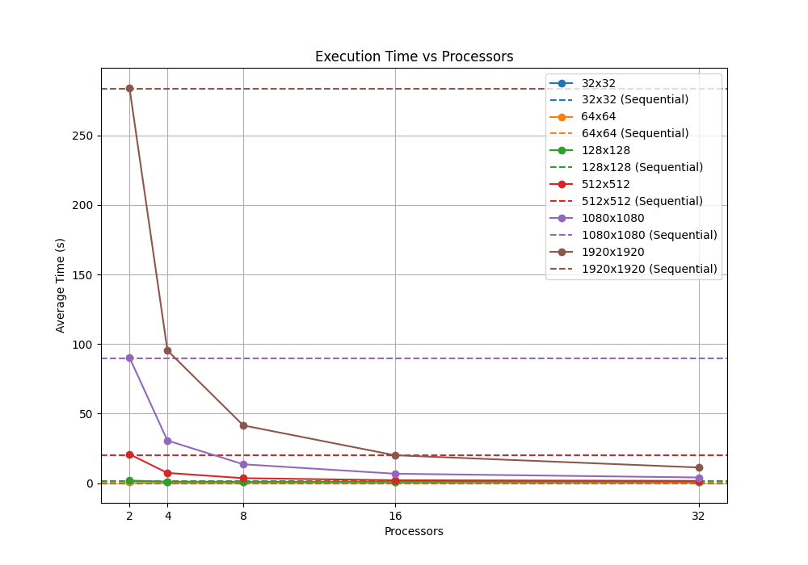{ width=100%  }
  Figura 5: Tiempo medio paralelo y secuencial para cada configuración de cantidada de nodos y resolución de imagen

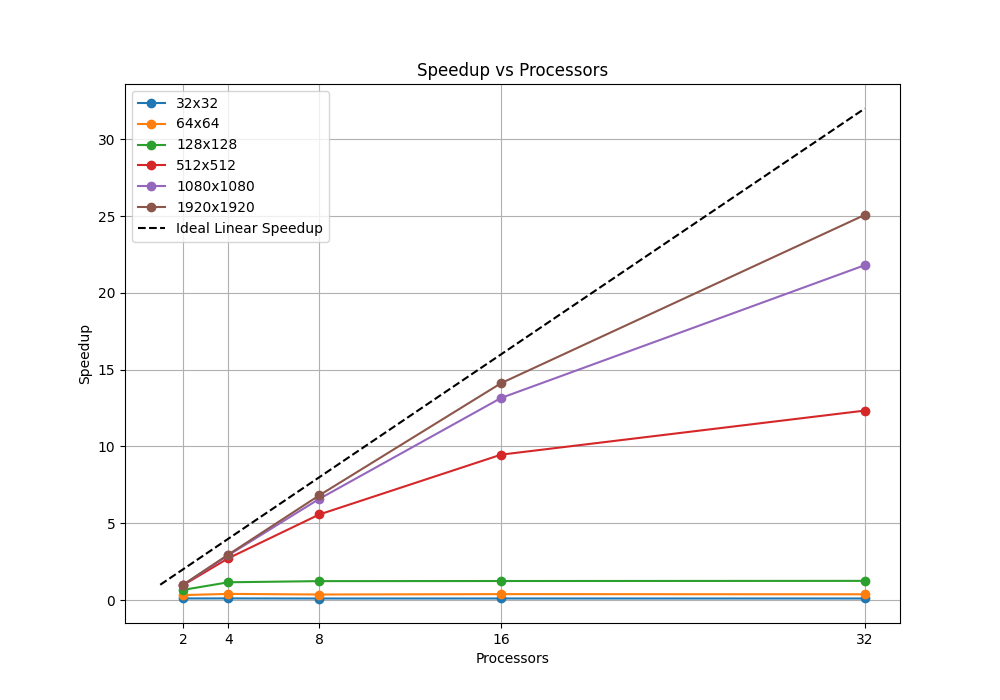{ width=100% }
  Figura 6: Speedup para cada configuración de cantidad de nodos y resolución de imagen

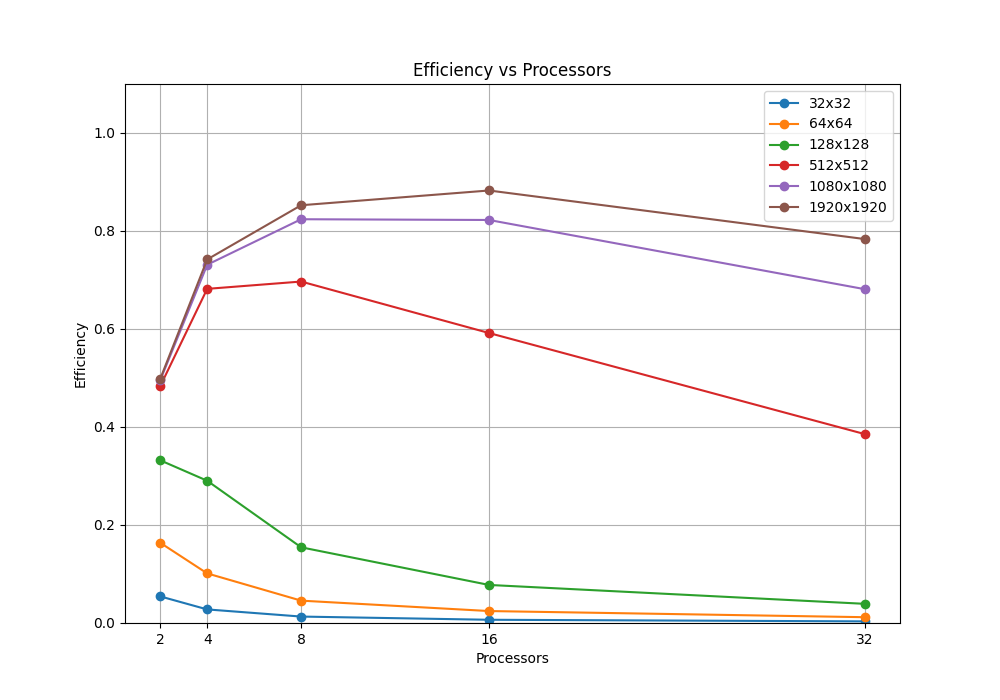{ width=100%}
  Figura 7: Eficiencia para cada configuración de cantidad de nodos y resolución de imagen

### Tamaño de bloque
Se estudió el efecto de modificar el tamaño de bloque en el tiempo de ejecución.

#### Tabla de datos de ejecución secuencial

A continuación se presentan los datos obtenidos a partir de las ejecuciones de la versión secuencial. Nótese que se presenta una sola fila, ya que tanto la cantidad de nodos como el tamaño de los bloques, son parámetros pertinentes a la versión paralela.

| Tiempo promedio (s) | Desviación estándar (s) |
| --------------------| ----------------------- |
| 89.60659603270032   | 0.020723353358982382    |
Tabla 11: Tiempo promedio y desviación estándar en segundos de la versión secuencial.

#### Tabla de datos de ejecución paralela

| Cantidad de nodos | Tamaño de bloque | Tiempo promedio (s) | Desviación estándar (s) |
| --- | --- | --- | --- |
| 2 | 2x2 | 91.43973352199973 | 0.05611679641446187 |
| 4 | 2x2 | 31.363201925400062 | 0.035844511996024966 |
| 8 | 2x2 | 17.032129470899235 | 0.16132378141367337 |
| 16 | 2x2 | 9.80977562420012 | 0.135481889137545 |
| 32 | 2x2 | 7.282809931899829 | 0.41415118461081607 |
| 2 | 4x4 | 90.62620872690096 | 0.030289694627595516 |
| 4 | 4x4 | 30.74810164060109 | 0.028864040552125478 |
| 8 | 4x4 | 14.44186259309863 | 0.021789357986847967 |
| 16 | 4x4 | 7.489232776599965 | 0.02892393616505963 |
| 32 | 4x4 | 4.734652727498178 | 0.1061245533777847 |
| 2 | 8x8 | 90.39643993430218 | 0.04501368269027079 |
| 4 | 8x8 | 30.60676306569949 | 0.021960356024083506 |
| 8 | 8x8 | 13.767168696501177 | 0.016930315679874557 |
| 16 | 8x8 | 6.886950576501112 | 0.023923186072850967 |
| 32 | 8x8 | 4.030236448300275 | 0.028466196545113925 |
| 2 | 16x16 | 90.33003026119987 | 0.0241139508851428 |
| 4 | 16x16 | 30.56708972500055 | 0.02466749615701291 |
| 8 | 16x16 | 13.5533268640007 | 0.019474163858620858 |
| 16 | 16x16 | 6.769189039500634 | 0.011171972498731777 |
| 32 | 16x16 | 3.9328893263009377 | 0.029974776402533564 |
| 2 | 32x32 | 90.32909833449958 | 0.0367866529867054 |
| 4 | 32x32 | 30.55001384190109 | 0.025399354470591846 |
| 8 | 32x32 | 13.534426990599604 | 0.023568102796302857 |
| 16 | 32x32 | 6.729872261199489 | 0.02568826934816551 |
| 32 | 32x32 | 4.0352310534013665 | 0.06224605207022667 |
| 2 | 64x64 | 90.31254809760067 | 0.018955403618388288 |
| 4 | 64x64 | 30.53957045689749 | 0.014845691365458883 |
| 8 | 64x64 | 13.52947120099925 | 0.023050388169619195 |
| 16 | 64x64 | 6.8264736725002875 | 0.04820564927923986 |
| 32 | 64x64 | 4.748673433499789 | 0.2314093086447298 |
| 2 | 128x128 | 90.3150229341998 | 0.027878257268597707 |
| 4 | 128x128 | 30.56140734679939 | 0.02336154178751105 |
| 8 | 128x128 | 14.937172039599682 | 0.019059549888477616 |
| 16 | 128x128 | 8.014758754597278 | 0.07856331140741309 |
| 32 | 128x128 | 6.913615914300317 | 0.6075389399688722 |
Tabla 12: Tiempo promedio y desviación estándar en segundos de la versión secuencial para cada configuración de cantidad de nodos y tamaño de bloque.

#### Gráficos de rendimiento

A continuación, se presentan gráficos realizados con los datos obtenidos previamente.

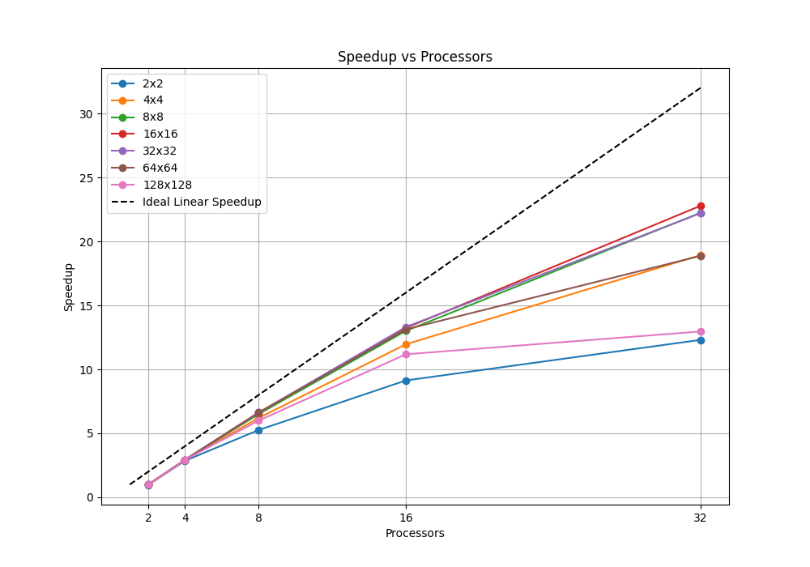{ width=100% }
  Figura 8: Speedup para cada configuración de cantidad de nodos y tamaño de bloque

{ width=100%}
  Figura 9: Eficiencia para cada configuración de cantidad de nodos y tamño de bloque


#### Tabla de datos de speedup y eficiencia

A partir de los tiempos anteriores, se calculó el Speedup y la Eficiencia de la versión paralela respecto a la secuencial.

| Cantidad de nodos | Tamaño de bloque | Speedup | Eficiencia |
| --- |  --- | --- | --- |
| 2 | 2x2 | 0.9799525062170226 | 0.4899762531085113 |
| 4 | 2x2 | 2.8570614775186836 | 0.7142653693796709 |
| 8 | 2x2 | 5.261033048498158 | 0.6576291310622697 |
| 16 | 2x2 | 9.134418509190597 | 0.5709011568244123 |
| 32 | 2x2 | 12.3038493206049 | 0.38449529126890314 |
| 2 | 4x4 | 0.9887492513642141 | 0.49437462568210705 |
| 4 | 4x4 | 2.9142155532093077 | 0.7285538883023269 |
| 8 | 4x4 | 6.2046426113707005 | 0.7755803264213376 |
| 16 | 4x4 | 11.964723050493939 | 0.7477951906558712 |
| 32 | 4x4 | 18.925695545161776 | 0.5914279857863055 |
| 2 | 8x8 | 0.9912624446031736 | 0.4956312223015868 |
| 4 | 8x8 | 2.927673071482721 | 0.7319182678706803 |
| 8 | 8x8 | 6.50871635323777 | 0.8135895441547213 |
| 16 | 8x8 | 13.01106999931813 | 0.8131918749573831 |
| 32 | 8x8 | 22.23358286347971 | 0.694799464483741 |
| 2 | 16x16 | 0.991991210161143 | 0.4959956050805715 |
| 4 | 16x16 | 2.9314729285271763 | 0.7328682321317941 |
| 8 | 16x16 | 6.611409651065558 | 0.8264262063831948 |
| 16 | 16x16 | 13.237419653936957 | 0.8273387283710598 |
| 32 | 16x16 | 22.783909893792874 | 0.7119971841810273 |
| 2 | 32x32 | 0.9920014445497536 | 0.4960007222748768 |
| 4 | 32x32 | 2.933111470797429 | 0.7332778676993572 |
| 8 | 32x32 | 6.620642018678514 | 0.8275802523348142 |
| 16 | 32x32 | 13.314754360096789 | 0.8321721475060493 |
| 32 | 32x32 | 22.206063258055412 | 0.6939394768142316 |
| 2 | 64x64 | 0.9921832338941714 | 0.4960916169470857 |
| 4 | 64x64 | 2.9341144846541973 | 0.7335286211635493 |
| 8 | 64x64 | 6.6230671325929 | 0.8278833915741125 |
| 16 | 64x64 | 13.126337305550717 | 0.8203960815969198 |
| 32 | 64x64 | 18.869816441906796 | 0.5896817638095874 |
| 2 | 128x128 | 0.9921560458217941 | 0.49607802291089703 |
| 4 | 128x128 | 2.9320179864715743 | 0.7330044966178936 |
| 8 | 128x128 | 5.998899644132491 | 0.7498624555165614 |
| 16 | 128x128 | 11.180198777823705 | 0.6987624236139816 |
| 32 | 128x128 | 12.960887203374362 | 0.4050277251054488 |
Tabla 13: Speedup y eficiencia para cada configuración de tamaño de bloque y cantidad de nodos de versión paralela.


## Balanceo de carga mediante herramientas de *Profiling*

Se presentan los datos recopilados a través de *Score-P*. Se involucran los promedios de todos los nodos, tanto en tiempo (segundos) como en cantidad de invocaciones por función.

### Tamaño de bloque $2 \times 2$

| Rutina | Total (Segundos) | Promedio | Varianza | Desviación estándar |
| --- | --- | --- | --- | --- |
| MPI_Init | 1.96143 | 0.24518 | 1.48667e-05 | 0.00386 |
| MPI_Comm_rank | 2.2664e-05 | 0.00000 | 5.71630e-15 | 0.00000 |
| MPI_Comm_size | 8.53949e-06 | 0.00000 | 1.19236e-14 | 0.00000 |
| MPI_Bcast | 0.0347405 | 0.00434 | 3.05655e-06 | 0.00175 |
| MPI_Finalize | 0.420225 | 0.05253 | 4.49685e-04 | 0.02121 |
| MPI_Send | 0.451702 | 0.05646 | 5.23487e-04 | 0.02288 |
| MPI_Probe | 6.28315 | 0.78539 | 1.01581e-01 | 0.31872 |
| MPI_Recv | 0.451702 | 0.05646 | 5.23487e-04 | 0.02288 |
| render_block | 146.615 | 18.32690 | 5.48377e+01 | 7.40525 |

Tabla 15: Estadísticas de cada rutina basadas en el tiempo

| Rutina | Total (Invocaciones) | Promedio | Varianza | Desviación estándar |
| --- | --- | --- | --- | --- |
| MPI_Init | 8.0 | 1.00000 | 0.00000e+00 | 0.00000 |
| MPI_Comm_rank | 8.0 | 1.00000 | 0.00000e+00 | 0.00000 |
| MPI_Comm_size | 8.0 | 1.00000 | 0.00000e+00 | 0.00000 |
| MPI_Bcast | 72.0 | 9.00000 | 0.00000e+00 | 0.00000 |
| MPI_Finalize | 8.0 | 1.00000 | 0.00000e+00 | 0.00000 |
| MPI_Send | 874807.0 | 109351.00000 | 1.95300e+09 | 44192.75959 |
| MPI_Probe | 291607.0 | 36450.90000 | 2.17007e+08 | 14731.15746 |
| MPI_Recv | 874807.0 | 109351.00000 | 1.95300e+09 | 44192.75959 |
| render_block | 291600.0 | 36450.00000 | 2.16996e+08 | 14730.78409 |
Tabla 16: Estadísticas de cada rutina basadas en la cantidad de invocaciones

### Tamaño de bloque $16 \times 16$

| Rutina | Total (Segundos) | Promedio | Varianza | Desviación estándar |
| --- | --- | --- | --- | --- |
| MPI_Init | 1.956 | 0.24450 | 1.62173e-05 | 0.00403 |
| MPI_Comm_rank | 1.91757e-05 | 0.00000 | 2.21643e-15 | 0.00000 |
| MPI_Comm_size | 6.39489e-06 | 0.00000 | 3.24449e-15 | 0.00000 |
| MPI_Bcast | 0.0216631 | 0.00271 | 1.18622e-06 | 0.00109 |
| MPI_Finalize | 0.268119 | 0.03351 | 1.83219e-04 | 0.01354 |
| MPI_Send | 0.0475489 | 0.00594 | 5.91193e-06 | 0.00243 |
| MPI_Probe | 0.188083 | 0.02351 | 9.46839e-05 | 0.00973 |
| MPI_Recv | 0.0475489 | 0.00594 | 5.91193e-06 | 0.00243 |
| render_block | 137.457 | 17.18210 | 4.81999e+01 | 6.94261 |
Tabla 17: Estadísticas de cada rutina basadas en el tiempo

| Rutina | Total (Invocaciones) | Promedio | Varianza | Desviación estándar |
| --- | --- | --- | --- | --- |
| MPI_Init | 8.0 | 1.00000 | 0.00000e+00 | 0.00000 |
| MPI_Comm_rank | 8.0 | 1.00000 | 0.00000e+00 | 0.00000 |
| MPI_Comm_size | 8.0 | 1.00000 | 0.00000e+00 | 0.00000 |
| MPI_Bcast | 72.0 | 9.00000 | 0.00000e+00 | 0.00000 |
| MPI_Finalize | 8.0 | 1.00000 | 0.00000e+00 | 0.00000 |
| MPI_Send | 13879.0 | 1734.88000 | 5.11631e+05 | 715.28386 |
| MPI_Probe | 4631.0 | 578.87500 | 5.69581e+04 | 238.65896 |
| MPI_Recv | 13879.0 | 1734.88000 | 5.11631e+05 | 715.28386 |
| render_block | 4624.0 | 578.00000 | 5.67929e+04 | 238.31261 |
Tabla 18: Estadísticas de cada rutina basadas en la cantidad de invocaciones

### Tamaño de bloque $128 \times 128$

| Rutina | Total (Segundos) | Promedio | Varianza | Desviación estándar |
| --- | --- | --- | --- | --- |
| MPI_Init | 2.01492 | 0.25187 | 1.35331e-05 | 0.00368 |
| MPI_Comm_rank | 1.93651e-05 | 0.00000 | 1.07870e-15 | 0.00000 |
| MPI_Comm_size | 5.02335e-06 | 0.00000 | 5.77806e-15 | 0.00000 |
| MPI_Bcast | 0.0354399 | 0.00443 | 3.17999e-06 | 0.00178 |
| MPI_Finalize | 15.1912 | 1.89890 | 2.01620e+00 | 1.41993 |
| MPI_Send | 0.00402743 | 0.00050 | 1.37961e-07 | 0.00037 |
| MPI_Probe | 0.127127 | 0.01589 | 7.55630e-05 | 0.00869 |
| MPI_Recv | 0.00402743 | 0.00050 | 1.37961e-07 | 0.00037 |
| render_block | 135.033 | 16.87910 | 4.79528e+01 | 6.92480 |
Tabla 19: Estadísticas de cada rutina basadas en el tiempo

| Rutina | Total (Invocaciones) | Promedio | Varianza | Desviación estándar |
| --- | --- | --- | --- | --- |
| MPI_Init | 8.0 | 1.00000 | 0.00000e+00 | 0.00000 |
| MPI_Comm_rank | 8.0 | 1.00000 | 0.00000e+00 | 0.00000 |
| MPI_Comm_size | 8.0 | 1.00000 | 0.00000e+00 | 0.00000 |
| MPI_Bcast | 72.0 | 9.00000 | 0.00000e+00 | 0.00000 |
| MPI_Finalize | 8.0 | 1.00000 | 0.00000e+00 | 0.00000 |
| MPI_Send | 250.0 | 31.25000 | 3.18500e+02 | 17.84657 |
| MPI_Probe | 88.0 | 11.00000 | 3.74286e+01 | 6.11789 |
| MPI_Recv | 250.0 | 31.25000 | 3.18500e+02 | 17.84657 |
| render_block | 81.0 | 10.12500 | 3.44107e+01 | 5.86606 |
Tabla 20: Estadísticas de cada rutina basadas en la cantidad de invocaciones

## Cantidad de iteraciones
Se estudió el efecto de modificar el número de iteraciones en el tiempo de ejecución.

### Tabla de datos

| Iteraciones | Tiempo promedio (s) | Desviación estándar (s) |
| --- | --- | --- |
| 200 | 0.8658388962008757 | 0.031467115018176055 |
| 500 | 0.9789770936957212 | 0.020520204910293226 |
| 1000 | 1.068946530300309 | 0.020387310065660757 |
| 2000 | 1.2362676242002635 | 0.021568939323107487 |
| 3000 | 1.4084850567989633 | 0.021316243515446965 |
| 4000 | 1.5473312993985018 | 0.020788707928570592 |
| 5000 | 1.6892066827014787 | 0.042628523113125386 |
| 10000 | 2.454260219701973 | 0.034755324130547174 |
| 15000 | 3.2485190514998976 | 0.037265794864773556 |
| 20000 | 4.026260491098219 | 0.058440292592556196 |
| 40000 | 7.153266767101013 | 0.08296469529306266 |

Tabla 14: Tiempo promedio y desviación estándar en segundos de la versión paralela para distintas iteraciones máximas.

### Gráfico de rendimiento

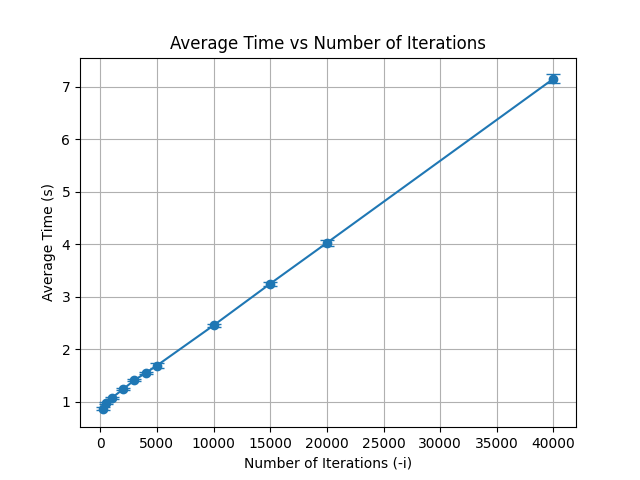{ width=100%}
  Figura 10: Tiempo de ejecución medio por cantidad de iteraciones

# Análisis de los Resultados
En esta sección, se realiza un análisis de los resultados obtenidos en la sección anterior.

## Análisis de versión secuencial contra paralela

### Tamaño de imagen
La *figura 5*, ilustra claramente que existe una mejora significativa al usar el algoritmo paralelo. 

Se puede observar que las versiones paralelas y secuenciales toman aproximadamente el mismo tiempo cuando la cantidad de nodos es de 2. Esto no debería sorprender considerando el modelo de algoritmo paralelo que se ha seleccionado, siendo este el master-worker. Al haber dos nodos, uno toma el rol de master y el otro de worker, pero en realidad solo un nodo se encarga del renderizado, siendo este el worker. Nos encontramos con un escenario donde un nodo trabaja (worker) mientras el otro espera los resultados y envía nuevas tareas a demanda (master), lo cuál provoca un comportamiento similar al de la versión secuencial, más los tiempos de comunicaciones entre nodos.

Luego, a medida que aumenta la cantidad de nodos, el tiempo paralelo decrece logarítmicamente, lo cuál se ve con mayor claridad en grandes resoluciones, especialmente $1920 \times 1920$. Es decir que se pueden obtener los mismos resultados en menor tiempo, tal como era esperado.

En cuanto a la *figura 6*, se observa que existe una relación entre el speedup obtenido y la resolución de la imagen. Si la imagen a renderizar cuenta con muy pocos píxeles, tal como la resolución 128x128, entonces podemos decir que no resulta conviente la utilización del algoritmo paralelo. Esto se debe a la sección secuencial inicial presente en la versión paralela, la cuál corresponde a la inicialización de mpi, a través de `MPI_Init`, toma aproximadamente 250ms. Al aumentar la resolución, aumenta la cantidad de píxeles a renderizar, haciendo que aumente la porción paralelizable, y es por este motivo que el speedup aumenta al renderizar imágenes con más píxeles, se aprovecha el paralelismo.

Al considerar la *figura 7*, se observa que a mayor cantidad de píxeles, es decir, en imágenes de mayor resolución, la eficiencia con dos nodos es de 0.5. El hecho que provoca tal resutado, es que solo un nodo trabaja, como se ha detallado al inicio de esta sección.

En este contexto, si asumimos que el tiempo secuencial es igual al tiempo de cómputo:
$$
T_{Secuencial}=T_{Paralelo}
$$
Entonces el speeup:
$$
Speedup(2)=T_{Secuencial}/T_{Paralelo}=1
$$
Luego, calculando la eficiencia
$$
Eficiencia(2)=Speedup(2)/N_{nodos}=1/2
$$
Lo cuál demuestra matemáticamente que el valor de eficiencia obtenido con 2 nodos es correcto.

Además, si consideramos las gráficas correspondientes a las distintas resoluciones mostradas en la *figura 7*, podemos afirmar que el punto máximo de eficiencia depende tanto de la resolución de la imagen como de la cantidad de nodos utilizados.

Para las versiones de $32 \times 32$, $64 \times 64$ y $128 \times 128$, la eficiencia máxima se alcanza con $N_{\text{Nodos}} = 2$. Esto no debería sorprender, ya que, al observar nuevamente la *figura 6*, se puede ver que estas resoluciones mantienen un speedup constante a partir de $N_{\text{Nodos}} = 2$.

Por otro lado, al analizar la resolución de $512 \times 512$, la eficiencia máxima se obtiene con $N_{\text{Nodos}} = 8$, alcanzando un valor de eficiencia de:
$$
Eficiencia(8)=0.697
$$
De manera similar, para una resolución de $1080 \times 1080$, la eficiencia máxima también se da con $N_{\text{Nodos}} = 8$, con un valor de:
$$
Eficiencia(8)=0.824
$$
Finalmente, para una resolución de $1920 \times 1920$, el punto máximo de eficiencia se alcanza con $N_{\text{Nodos}} = 16$, alcanzando:
$$
Eficiencia(16)=0.883
$$

Si relacionamos los gráficos de speedup y eficiencia, se puede observar que la relación de orden entre las distintas resoluciones de imagen y su rendimiento se mantiene. Esto se debe a que la eficiencia se calcula a partir del speedup y la cantidad de nodos, siendo este un factor constante.

Es claro que la versión paralela no alcanzará el speedup superlineal, pero si tiende a alcanzar un speedup lineal. Hay una fuerte relación entre la porción paralelizable, la cuál aumenta al renderizar mayor cantidad de píxeles. 

Sin embargo, existe un umbral a partir del cuál no resulta conveniente emplear la versión paralela, ya que los tiempos secuenciales comienzan a representar una proporción significativa en relación con la parte paralelizable del problema.

A pesar de ello, al aumentar el tamaño de la imagen, la utilización de la versión paralela se vuelve cada vez más justificada y eficiente.

### Tamaño de bloque
Como ilusta la *figura 8*, existe una clara relación entre el speedup y el tamaño de los bloques. Lo mismo sucede en la *figura 9*, en cuanto a la eficiencia.

Se observa que el peor speedup se obtiene para bloques de $2 \times 2$, seguido por bloques de $128 \times 128$. Estos casos serán analizados con detalle en la siguiente sección.

En función del gráfico de speedup, se puede decir que el rendimiento del programa depende de la granularidad de las tareas. Tareas más chicas implican una mayor cantidad de comunicaciones, mientras que tareas grandes hacen que algunos nodos se queden ociosos, ya que el cómputo requerido para cada tarea no es equitativo.

Se pude observar que el tamaño que logra el balance es el de $16 \times 16$. 

Los tamaños de $8 \times 8$, $16 \times 16$ y $32 \times 32$. $8 \times 8$ y $32 \times 32$ presentaron un resultado prácticamente idéntico, con un speedup medio de $22.234$ y $22.206$ respectivamente. Pero indiscutiblemente, los mejores resultados, tanto en términos de speedup como eficiencia se obtuvieron con un tamaño de bloque de $16 \times 16$.

Otro aspecto importante a analizar, presente tanto en la *figura 8* como en la *figura 9*, es el aumento en la dispersión de las gráficas a medida que se incrementa la cantidad de nodos.

Este comportamiento es coherente, ya que al aumentar el número de nodos, la ejecución del programa se aleja progresivamente de su versión secuencial. Esto penaliza especialmente a aquellas configuraciones que no logran equilibrar adecuadamente la cantidad de comunicaciones con el tamaño de las tareas asignadas a cada nodo. Además, cuando se utilizan bloques de tamaño reducido, como $2 \times 2$, un mayor número de nodos implica un incremento en la cantidad de comunicaciones con el nodo maestro, lo que a su vez eleva los tiempos de respuesta.

Por lo tanto, se puede concluir que para los parámetros seleccionados y la cantidad de nodos, el tamaño de bloque óptimo es el de $16 \times 16$, al obtener el mayor speedup y eficiencia.

## Análisis de balanceo de carga mediante herramientas de *Profiling*
Es de interés analizar las tablas de datos obtenidas a través del *profiling* mediante *Score-P* [\[10\]](#score-p) para los casos más extremos, siendo estos $2 \times 2$ y $128 \times 128$, pero también el caso óptimo $16 \times 16$, con el fin justificar cuantitativamente su rendimiento.

- Bloque de tamaño $2 \times 2$: El bajo rendimiento se debe a el modelo de algoritmo paralelo seleccionado, y la alta granulaidad de las tareas. Un bloque de este tamaño contiene tan solo $4$ píxeles. En la *tabla 16*, se puede observar que se realizaron $291600$ llamadas a la función `render_block`, lo cuál nos dice que se creó esa cantidad de tareas. Este valor resulta coherente, ya que se ha renderizado una imagen de resolución $1080 \times 1080$, lo cuál resulta $1166400$ píxeles, y por cada tarea se renderizan $2 \times 2=4$ píxeles, y esto implica la creación de $1166400/4=291600$ tareas. Además, se han realizado $874807$ llamadas a `MPI_Send` y `MPI_Recv`, las cuales en conjunto con `MPI_Probe` tomaron un tiempo total de $7.187$ segundos. Por lo tanto, el bajo rendimiento se debe a que hay demasiada granularidad, la cuál implica muchas comunicaciones, y probablemente un master saturado.

- Bloque de tamaño $128 \times 128$: Nos encontramos con el caso opuesto al anterior, la granularidad es muy baja, las tareas son muy grandes. Que las tareas sean grandes implica un bajo aprovechamiento de la asignación dinámica de tareas, lo cuál hace que algunos nodos se queden ociosos, ya que distintas tareas tardan más en computarse. Este problema se ha planteado en la sección de [Asignación de tareas y balanceo de carga](#asignación-de-tareas-y-balanceo-de-carga). Realizando un análisis similar al anterior, al considerar la *tabla 20*, se puede observar que se han creado $81$ tareas y se realizaron tan solo $250$ llamadas a `MPI_Send` y `MPI_Recv`, las cuales con conjunto con `MPI_Probe` tomaron un tiempo total de $135ms$, un tiempo significativamente menor al de la configuración $2 \times 2$. Claramente $81$ tareas son muy pocas, y no se aprovecha del todo la asignación dinámica, lo cuál hace que presente un rendimiento similar a un algoritmo de asignación estática.

- Bloque de tamaño $16 \times 16$: Las *tablas 17 y 18* correspondientes exhiben los mejores resultados, se crearon $4624$ tareas, se realizaron $13879$ llamadas a `MPI_Send` y `MPI_Recv`, las cuales en conjunto con `MPI_Probe` formaron un tiempo total de comunicaciones de $283ms$. Esto representa un balance entre las configuraciones analizadas previamente.

Otra métrica interesante es la desviación estándar de la función `render_block` la cuál es mayor tanto en tiempo como en cantidad de iteraciones a menor tamaño de bloque. Si se renderizan pocos píxeles adyacentes ($2 \times 2$), se puede dar el caso donde estos toman mucho tiempo, al llegar al número de iteraciones máximas, o muy poco tiempo, al no pertenecer al conjunto del fractal. En cambio, al considerar tamaños de bloque grandes ($128 \times 128$), es más probable que se encuentren píxeles que toman mucho tiempo pero también algunos que toman muy poco, haciendo que se logre una especie de promedio entre estos, y en definitiva reduciendo la desviación estándar.

Esto es coherente con las suposiciones realizadas inicialmente al diseñar el modelo de asignación dinámica de tareas bajo demanda. Y es este el motivo por el cuál, contar con una desviación estándar relativamente alta, como en el caso de $16 \times 16$ resulta beneficioso.

Entonces, comportamiento observado evidencia que la escalabilidad del sistema depende fuertemente del equilibrio entre la granularidad de las tareas y la sobrecarga de comunicación. A medida que se incrementa la cantidad de nodos, este equilibrio se vuelve más crítico, ya que se amplifican tanto los beneficios como las deficiencias del esquema de distribución adoptado.

Un buen balance de carga no solo mejora el speedup, sino que también permite una asignación dinámica más eficiente, reduciendo tiempos ociosos y evitando cuellos de botella.

En definitiva, una escalabilidad efectiva no se logra únicamente con más nodos, sino mediante una correcta configuración del sistema que permita distribuir el trabajo de forma uniforme y con un costo de coordinación razonable. Esto reafirma la importancia de ajustar adecuadamente el tamaño de los bloques en función del modelo de ejecución y la arquitectura utilizada.


## Cantidad de iteraciones

A pesar de que el algoritmo de tiempo de escape utilizado por el fractal de Mandelbrot pueda terminar con una menor cantidad de iteraciones que la cantidad de iteraciones máximas, establecida por el parámetro, se puede observar un comportamiento lineal en los tiempos de ejecución, ilustrados en la *figura 10*. 

Este comportamiento lineal se debe a que en la imagen que se ha renderizado, existe una gran proporción de píxeles que llegan al límite de iteraciones máximo establecido por el parámetro. Estos píxeles son los que toman el color negro en las siguientes imágenes comparativas.

El renderizado se realizó utilizando distintas cantidades de iteraciones máximas, con el objetivo de evaluar su impacto en la calidad de imagen y el tiempo de ejecución:

| { width=120px } | 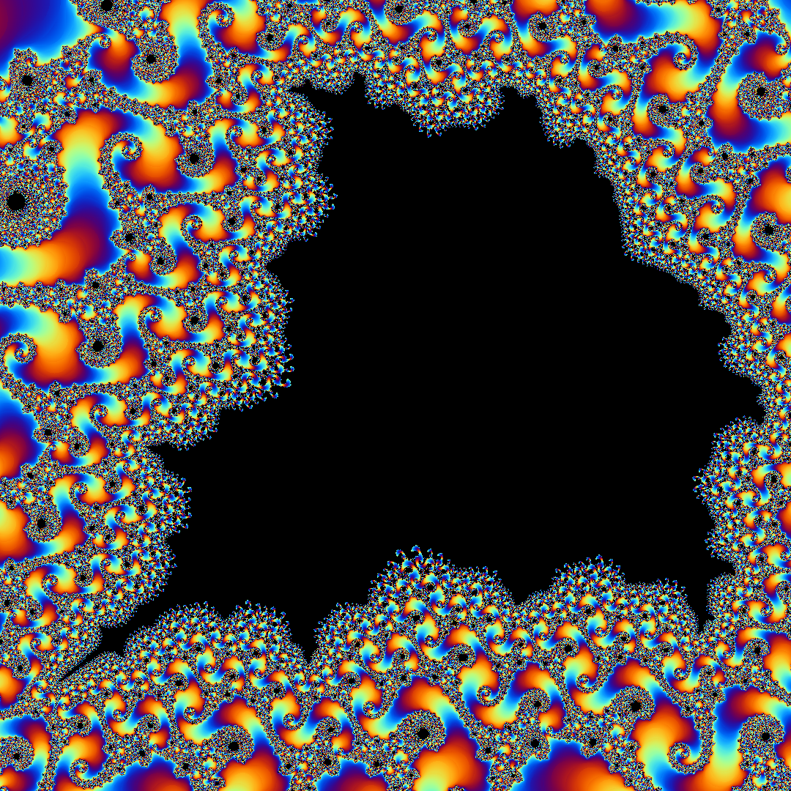{ width=120px } | 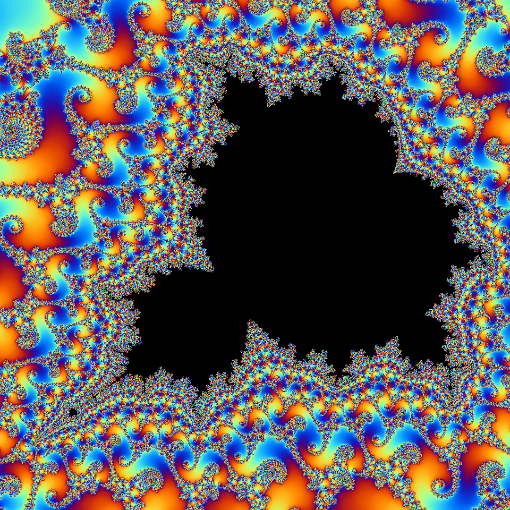{ width=120px } | 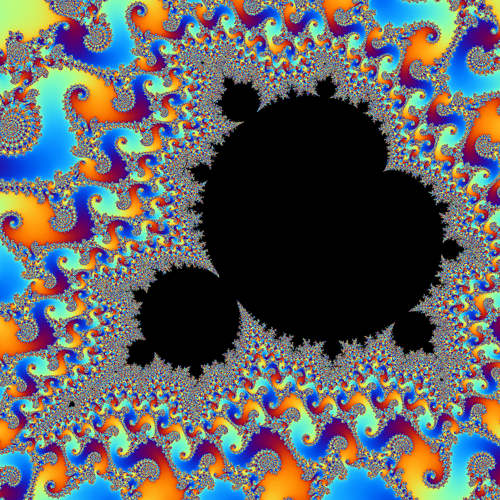{ width=120px } |
|:-------------------------------------------:|:--------------------------------------------:|:----------------------------------------------:|:----------------------------------------------:|
| 200 iteraciones                              | 500 iteraciones                               | 1000 iteraciones                                | 2000 iteraciones                                |

| { width=120px } | 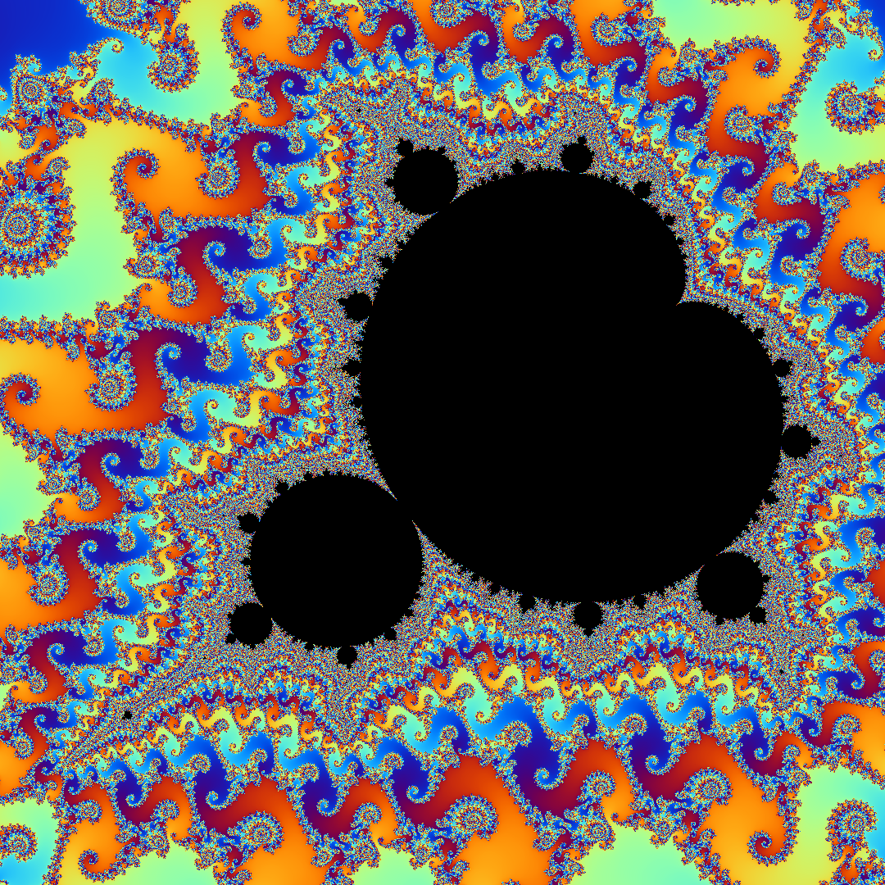{ width=120px } | 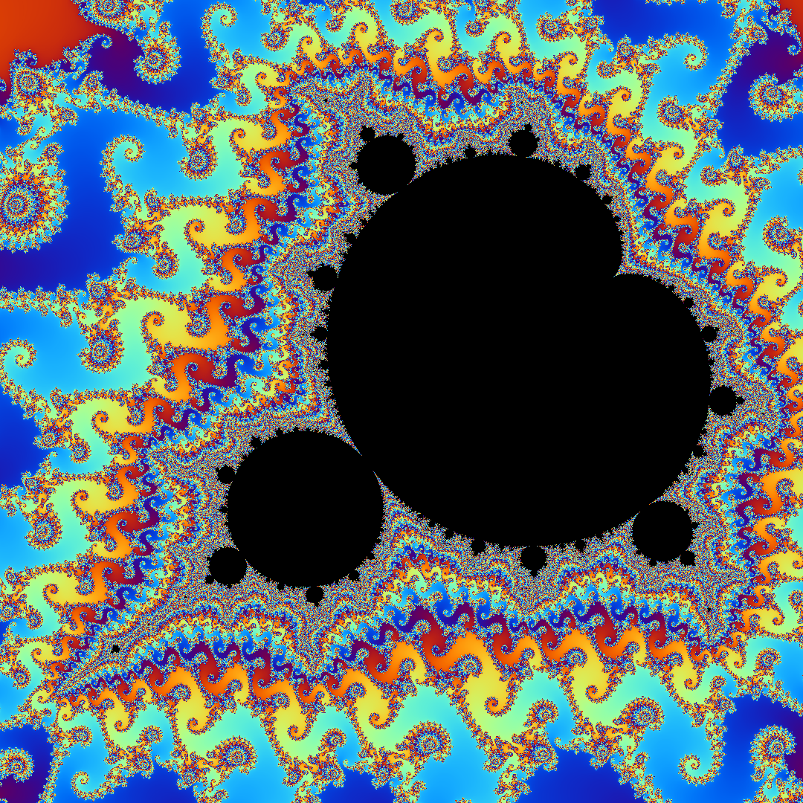{ width=120px } | 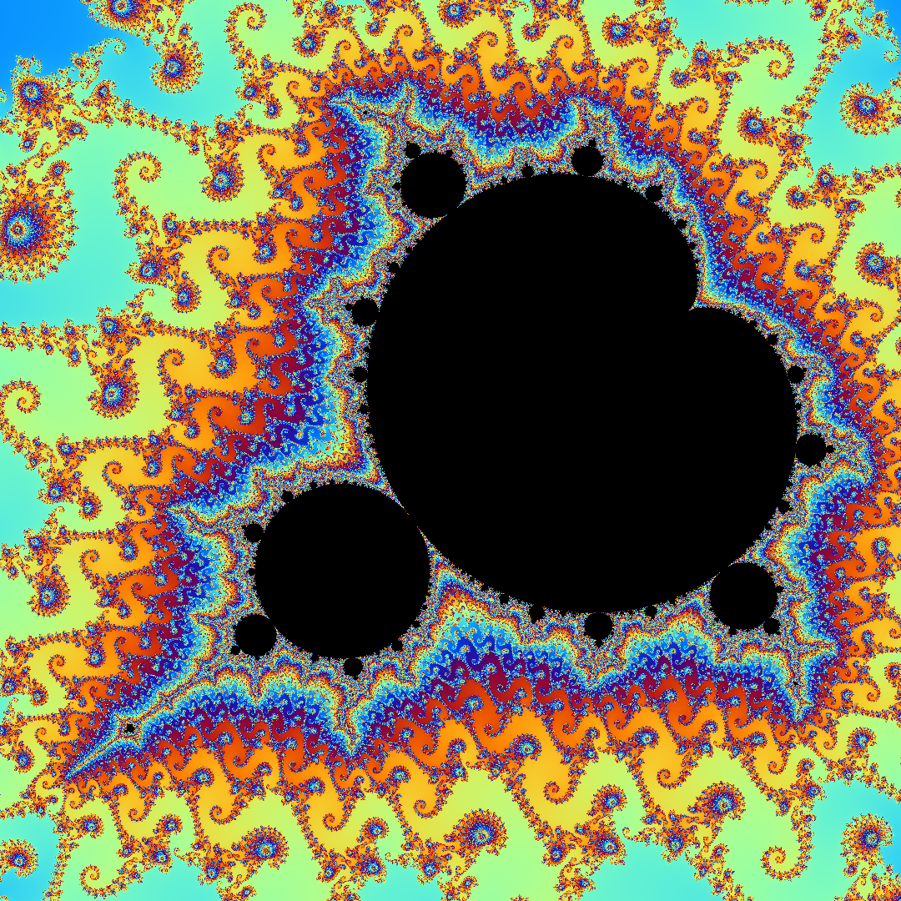{ width=120px } |
|:-------------------------------------------:|:--------------------------------------------:|:----------------------------------------------:|:----------------------------------------------:|
| 3000 iteraciones                              | 4000 iteraciones                               | 5000 iteraciones                                | 10000 iteraciones                                |

| 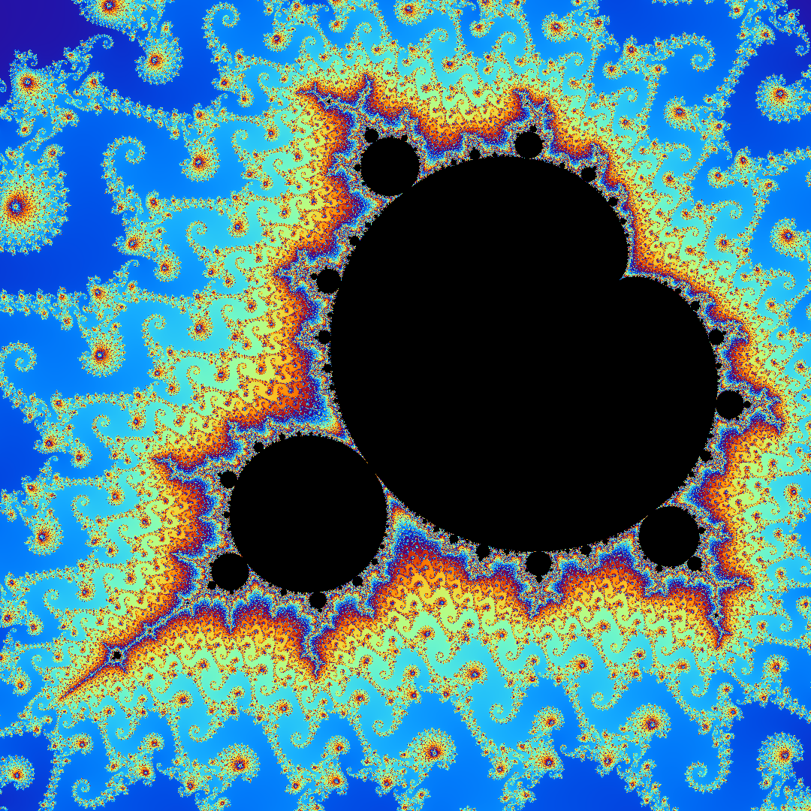{ width=120px } | 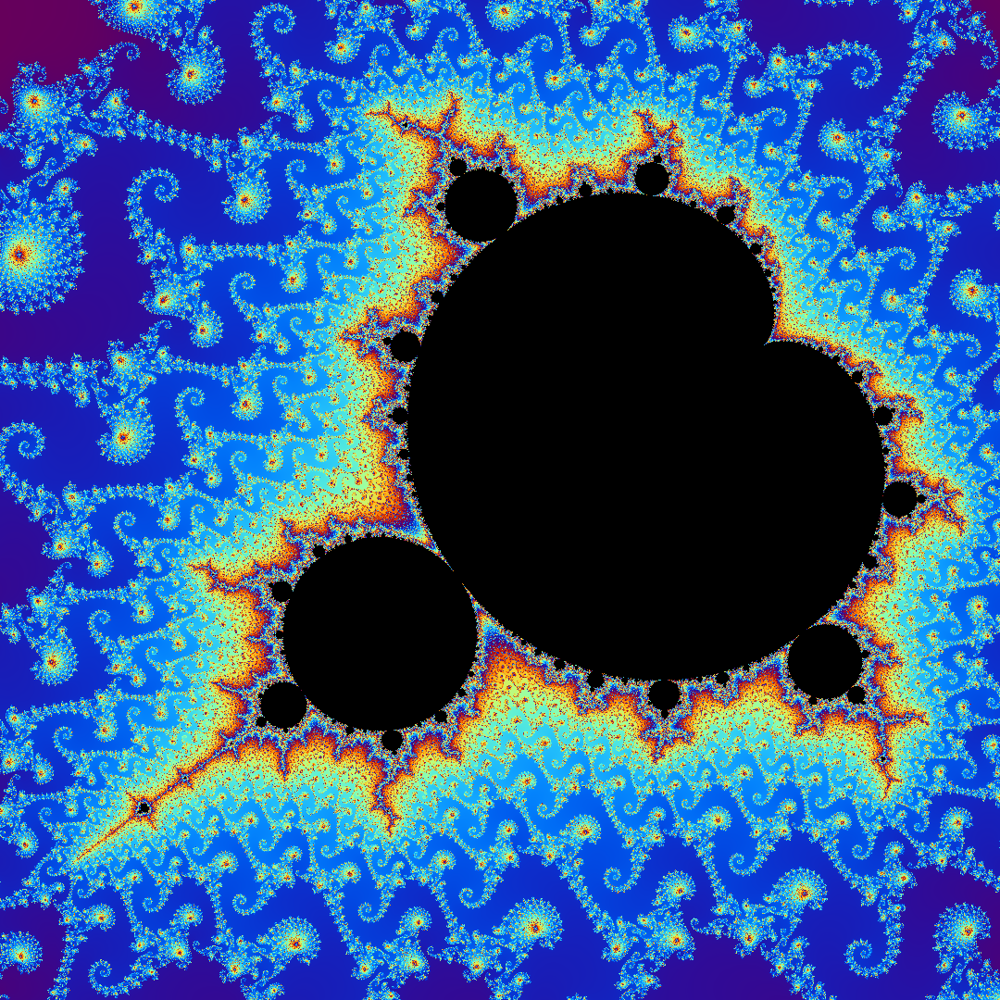{ width=120px } | 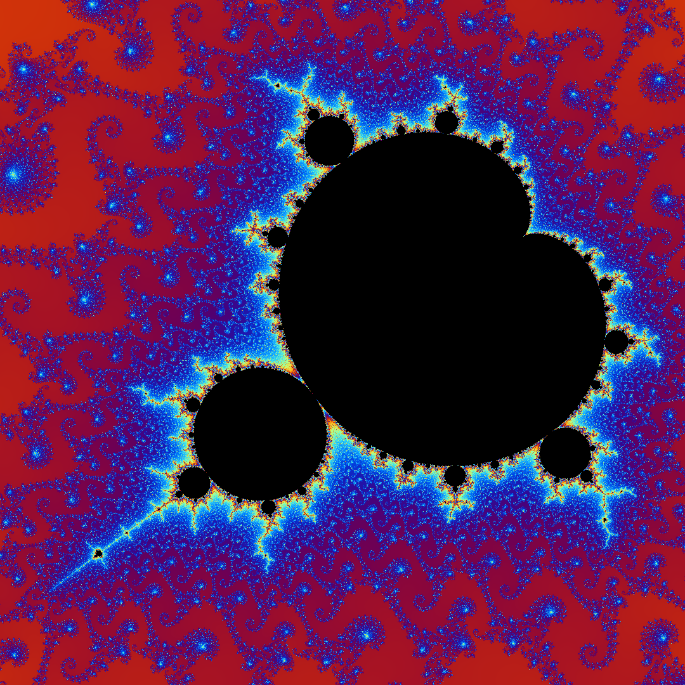{ width=120px } | 
|:-------------------------------------------:|:--------------------------------------------:|:----------------------------------------------:|
| 15000 iteraciones                              | 20000 iteraciones                               | 40000 iteraciones                                | 
Figura 11: Imágenes renderizadas con distintas cantidades de iteraciones.

Existe una diferencia notable en los resultados. Estos resultados varían tanto en las formas como en los colores y el ruido en la imagen. Cabe aclarar que con ruido se refiere a frecuencia de variación de color de píxeles adyacentes.

En cuanto a los colores, la diferencia radica en que el color se asigna al mapear la cantidad de iteraciones a las que llegó el pixel a una paleta de colores. Al aumentar o disminuir la cantidad de iteraciones máximas, el mapeo del número de iteraciones a un valor normalizado también cambia. Por ejemplo, supongamos que la función del fractal de Mandelbrot determina que un pixel $P=(P_X, P_Y)$ no pertenece al conjunto con $300$ iteraciones.

- $IteracionesMax = 1000$, entonces $t=300/1000=0.3$
- $IteracionesMax = 40000$, entonces $t=300/40000=0.00075$

Siendo $t$ el valor utilizado para muestrear la paleta de colores y asignarle el color al pixel $P$.

Ahora, si analizamos las formas, especialmente las imágenes obtenidas con $200$, $500$ y cualquier otra con muchas iteraciones, tal como la de $20000$, se puede observar que las secciones coloreadas en negro difieren y son mayores a menor cantidad de iteraciones. Esto se debe a que $200$, y $500$ iteraciones son muy pocas para el zoom utilizado, haciendo que el algoritmo considere a ciertos puntos como pertenecientes al conjunto de Mandelbrot, cuando en realidad no pertenecen.

Esto nos dice que existe una relación directa entre el zoom utilizado y la cantidad de iteraciones máximas. Haciendo que se requieran más iteraciones a mayor zoom.

El ruido es otro factor muy notable en las imágenes con una baja cantidad de iteraciones. Los píxeles cercanos al borde del conjunto de Mandelbrot son muy sensibles a pequeñas variaciones en la cantidad máxima de iteraciones. Con un valor bajo de iteraciones, muchos de estos píxeles se consideran escapados prematuramente, incluso si en realidad pertenecen al conjunto o están muy cerca de él. Esto provoca una coloración inconsistente entre píxeles vecinos, lo que genera una apariencia ruidosa. Aumentar la cantidad de iteraciones reduce esta incertidumbre y suaviza la imagen.

A pesar de que la imagen más precisa de todas es la de $40000$ iteraciones, se considera que para estas configuraciones de cámara, las imágenes de $15000$ y $20000$ iteraciones son las ideales, al balancear los tiempos de ejecución, $3.249$ segundos y 
$4.026$ segundos respectivamente, y la calidad de imagen obtenida.

En definitiva, se observa una diferencia significativa en las imágenes generadas al variar la cantidad máxima de iteraciones en la visualización del conjunto de Mandelbrot. Estas diferencias se manifiestan en los colores, las formas y el nivel de ruido presente. La cantidad de iteraciones influye directamente en la precisión del mapeo de colores, en la fidelidad de las formas observadas, especialmente en niveles altos de zoom, y en la suavidad de los bordes. Iteraciones bajas producen imágenes más ruidosas y con regiones negras más extensas, producto de clasificaciones erróneas.

# Conclusiones

En este trabajo se analizó el comportamiento computacional del conjunto de Mandelbrot mediante la implementación de versiones secuencial y paralela del algoritmo de generación de imágenes. El estudio se enfocó en evaluar el rendimiento bajo distintas configuraciones, incluyendo el tamaño de la imagen, el tamaño del bloque y la cantidad de iteraciones máximas por píxel.

Los resultados experimentales muestran que la versión paralela ofrece mejoras significativas en el tiempo de ejecución frente a la versión secuencial, especialmente a medida que aumentan el tamaño de la imagen y la complejidad del problema. Se observó que la eficiencia paralela mejora con la resolución, alcanzando su punto óptimo con una mayor cantidad de nodos en configuraciones de alta demanda computacional.

El estudio sobre el tamaño de los bloques evidenció la importancia crítica de este parámetro, dado su impacto directo en los tiempos de ejecución y su estrecha relación con el modelo master-worker adoptado en la paralelización, en conjunto con el modelo de asignación dinámica de tareas bajo demanda.

Asimismo, el análisis del número de iteraciones permitió evidenciar su doble impacto: por un lado, en la calidad visual de las imágenes generadas y, por otro, en el rendimiento general del sistema. Esto sugiere la necesidad de elegir cuidadosamente un valor que logre un equilibrio adecuado entre fidelidad visual y eficiencia computacional.

Finalmente, se identificó una posible limitación en el diseño actual del algoritmo paralelo: la figura del master como punto central de coordinación puede convertirse en un cuello de botella bajo ciertas configuraciones. Como línea de trabajo futura, se propone el desarrollo de una versión multihilo del master, capaz de atender a múltiples workers de manera concurrente, con el objetivo de reducir la espera ociosa y mejorar la escalabilidad del sistema.


# Referencias

**[1]** https://solarianprogrammer.com/2013/02/28/Mandelbrot-set-cpp-11/

**[2]** <a id="Mandelbrot"></a> https://en.wikipedia.org/wiki/Mandelbrot_set

**[3]** https://youtu.be/FFftmWSzgmk?si=KPTdCiAoU7zeQ5VQ

**[4]** https://youtu.be/LqbZpur38nw?si=QAimXxeVIlmIqf3I

**[5]** <a id="fractal-rendering"></a> https://cglearn.eu/pub/advanced-computer-graphics/fractal-rendering

**[6]** https://www.mpi-forum.org/docs/mpi-4.1/mpi41-report.pdf

**[7]** <a id="complex-dynamics"></a>https://en.wikipedia.org/wiki/Complex_dynamics

**[8]** <a id="dynamic-systems"></a>https://es.wikipedia.org/wiki/Sistema_din%C3%A1mico

**[9]** <a id="Julia-fatou"></a>https://en.wikipedia.org/wiki/Julia_set 

**[10]** <a id="score-p"></a>https://www.vi-hps.org/projects/score-p/

**[11]** <a id="vampir"></a>https://vampir.eu/

# Anexo - Código fuente

El código fuente de este trabajo, incluyendo las versiones secuencial y paralela se encuentra disponible en el siguiente repositorio de GitHub:  
[https://github.com/FrancoYudica/DistributedFractals](https://github.com/FrancoYudica/DistributedFractals)